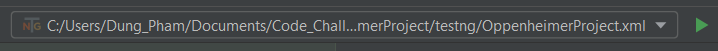
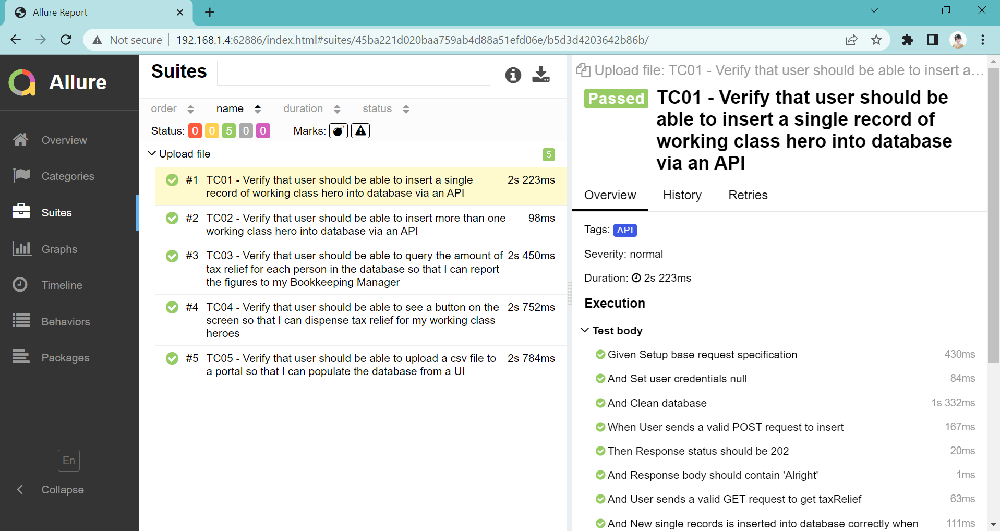

# cognizant-automation-framework
This is automated testing framework for Cognizant applications

## Getting started
### Prerequisites
Configuring local environment

* Java JDK 8 - https://www.oracle.com/sg/java/technologies/javase/javase8-archive-downloads.html
* Maven - https://maven.apache.org/download.cgi?Preferred=ftp://ftp.osuosl.org/pub/apache/
* Allure CLI - https://docs.qameta.io/allure/#_get_started (For windows https://repo.maven.apache.org/maven2/io/qameta/allure/allure-commandline/)
* Intellij Community as IDE (can be anything else) - https://www.jetbrains.com/idea/download/#section=windows

### Installing and Validation installing

* Environment variables validation:
```
#java -version
java version "1.8.0_202"
Java(TM) SE Runtime Environment (build 1.8.0_202-b08)
Java HotSpot(TM) 64-Bit Server VM (build 25.202-b08, mixed mode)
```
```
#mvn --version
Apache Maven 3.8.5 (3599d3414f046de2324203b78ddcf9b5e4388aa0)
Maven home: C:\Users\Dung_Pham\Documents\Software\apache-maven-3.8.5-bin\apache-maven-3.8.5
Java version: 1.8.0_202, vendor: Oracle Corporation, runtime: C:\Program Files\Java\jdk1.8.0_202\jre
Default locale: en_US, platform encoding: Cp1252
OS name: "windows 10", version: "10.0", arch: "amd64", family: "windows"
```
```
#allure --version
2.10.0
```
## Running the test
There are two ways to start tests.

* RECOMMENDED - First is to use TestNG files, run from `OppenheimerProject.xml` file by IntelliJ and right click and select Run... 


* Second way is to use Maven, run from terminal with command:
```
mvn clean install
```
## Check report generation
Run from terminal with command:
```
allure serve target/allure-results/
```
Report will look like this


## 3. More details about framework
### 3.1. Folder structure
**Main Folder**

- Java folder
    - Abstracts folder - contains abstract class for driver initialization. This class should extends all BasePages across all projects.
    - Endpoints folder - contains classes with methods manipulate endpoints
    - Pages folder – contains classes with methods for corresponding application page functionality.
    - Shared folder - contains classes with common methods for pages
    - Utils – contains all Selenium helping classes, custom framework extensions etc.
- Resources folder: contains folders with csv files, json request body files,...

**Test folder**
- Java folder
    - Project folder
        - Steps folder – contains JBehave steps for corresponding application page
        - Cucumber runner classes – configuration for test suites.
    - common folder
        - Steps folder - contains common steps
        - Cucumber runner common classes – configuration for common test suites.
- Resource folder
    - Project folder
        - Features folder – contains feature files with test scenarios.
        - TestNG folder – contains TestNG xml configuration and suites files.

### 3.2. Plugin support for developement
* Cucumber for Java - https://plugins.jetbrains.com/plugin/7212-cucumber-for-java
* Gherkins - https://plugins.jetbrains.com/plugin/9164-gherkin
## 4. Test cases automated
We will have many cases to test this function, I picked one testcase to automate it.

**TC01: Verify that user should be able to insert a single record of working class hero into database via an API**

More details testcase in `InsertData.feature`

**TC02: Verify that user should be able to insert more than one working class hero into database via an API**

More details testcase in `InsertData.feature`

**TC03: Verify that user should be able to query the amount of tax relief for each person in the database so that I can report the figures to my Bookkeeping Manager**

More details testcase in `TaxRelief.feature`

**TC04: Verify that user should be able to see a button on the screen so that I can dispense tax relief for my working class heroes**

More details testcase in `TaxRelief.feature`

**TC05: Verify that user should be able to upload a csv file to a portal so that I can populate the database from a UI**

More details testcase in `UploadFile.feature`

```
Note: I disabled step validate tax relief amount and will enable it once bugs are fixed - I added this like TODO with comment
```

## 5. Points to be considered for improvement
- Separate API automation framework and UI automation framework and link them through microservices (this makes framework easy to scale up in the future)
